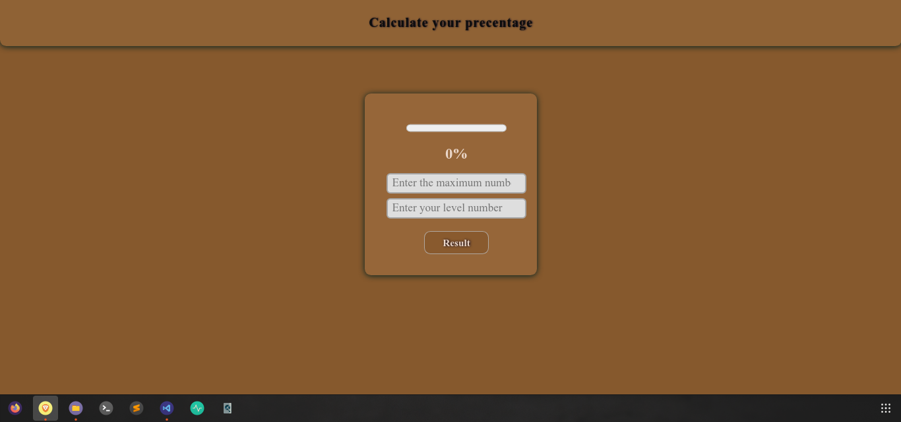
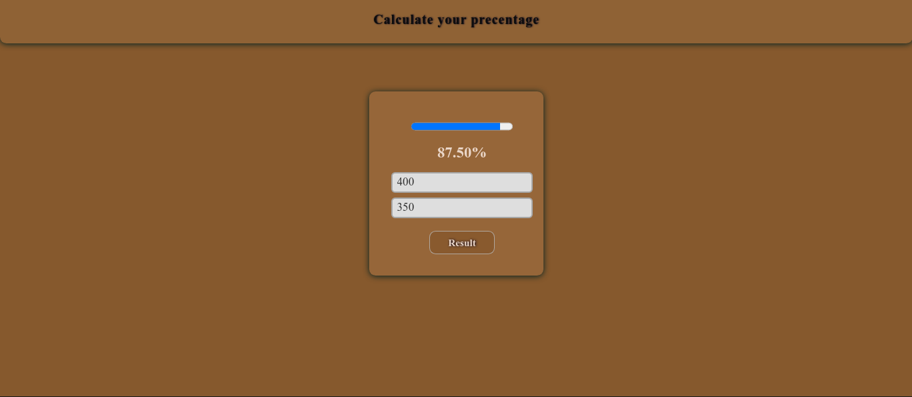
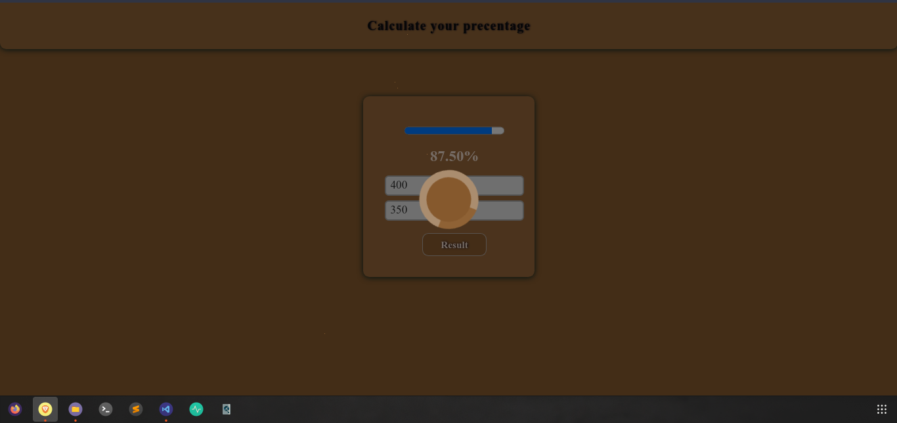
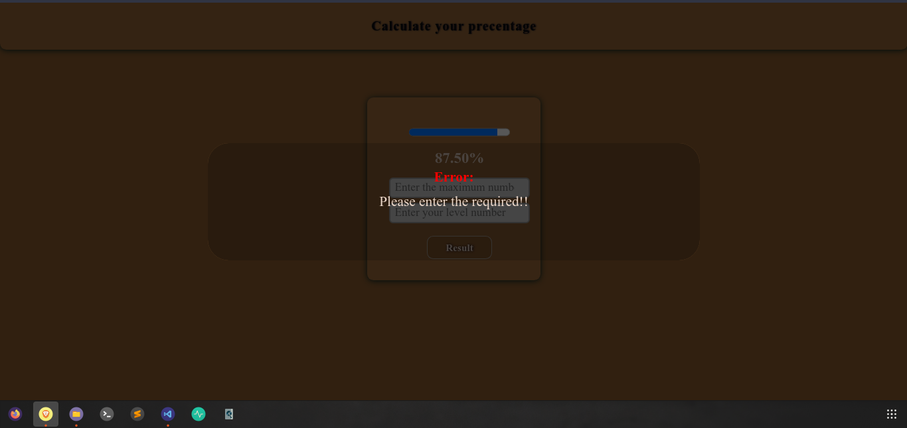

#  Percentage Calculator:
## percentage-calc 
- This project is about a simple calculator for those who want to know their precentage in something they are make a progress in.
- It help you getting know how much you have finished using percentage ``` % ```

- You will be motivated for sure when you know how much you have finished.

- Helps getting know the percentage of students in high school or even University students etc...
---
## Screenshots:
- The webpage:

- Trying the Application:

- Loader screen:

- Error When no-input message:

- Error When exceed the maximum message:


---
## Usage: 

- Clone the project from:
``` 
git clone https://github.com/Ahmed-Osama2022/precentage-calc.git 
```
---
### This was made by Ahmed Osama Elsayed
---
